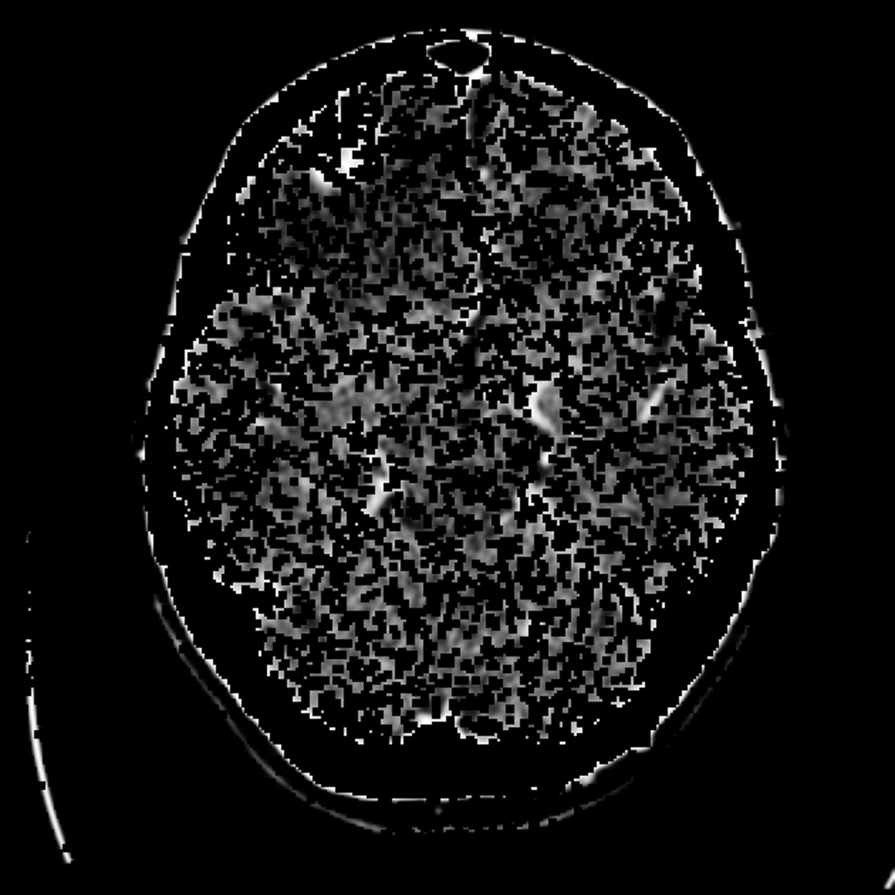

# Image Processing with OpenCV and Python


## Overview
This project applies multiple image processing techniques using OpenCV and Python. The script enhances image quality, reduces noise, detects edges, and increases resolution. Processed images are displayed and saved in categorized folders.

## Features
- **Contrast Enhancement**: Uses CLAHE (Contrast Limited Adaptive Histogram Equalization) for improved visibility.
- **Noise Reduction**: Applies Gaussian Blur to smoothen the image.
- **Edge Detection**: Utilizes the Canny edge detection algorithm.
- **Resolution Enhancement**: Scales up images with bicubic interpolation.
- **Automatic Image Saving**: Processed images are stored in structured directories.

## Installation
1. Clone the repository:
   ```sh
   git clone https://github.com/yourusername/image-processing-opencv.git
   cd image-processing-opencv
   ```
2. Install dependencies:
   ```sh
   pip install -r requirements.txt
   ```

## Usage
Run the script with an image path:
```sh
python process_image.py
```
By default, it processes `img2.jpg`. Modify the script to specify another image.

## Example Results
### Original vs. Processed Images
| Original | Contrast Enhanced | Noise Reduced |
|----------|------------------|--------------|
|  |  |  |

| Edges Detected | Resized Image | RGB Conversion |
|---------------|--------------|---------------|
|  |  |  |

## Folder Structure
```
image-processing-opencv/
│── process_image.py
│── requirements.txt
│── README.md
│── images/
│── Processed_Images/
│   ├── Original/
│   ├── Contrast Enhanced/
│   ├── Denoised/
│   ├── Edges/
│   ├── Resized/
│   ├── RGB/
```

## Dependencies
- OpenCV
- NumPy
- Matplotlib
- Pillow (PIL)

Install dependencies via:
```sh
pip install opencv-python numpy matplotlib pillow
```

## Contributing
Pull requests are welcome. For major changes, open an issue first to discuss modifications.

## License
This project is licensed under the MIT License. See `LICENSE` for details.

---
**Author**: Lecheheb Djaafar 

🌍 Linkdin: [Lecheheb Djaafar](https://www.linkedin.com/in/lecheheb-djaafar-226594348/)

